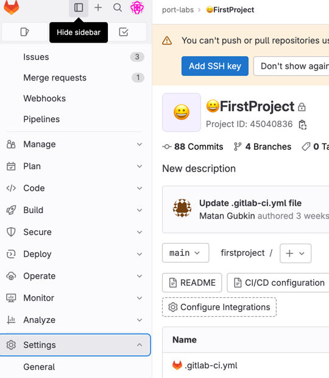
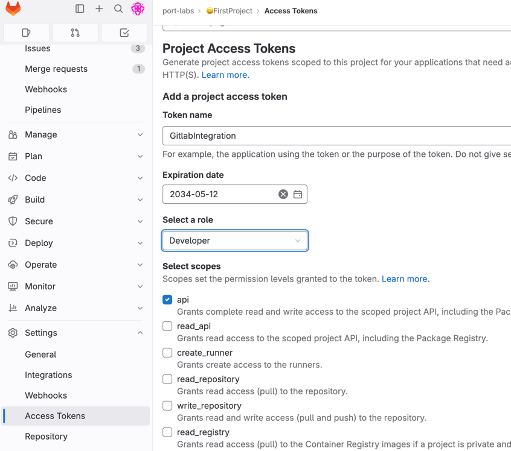

# Installation

:::note Prerequisites

- A gitlab account with admin privileges.;
- A gitlab group account with api privileges. (Refer to the [permissions](./gitlab.md#permissions) section for more information);
- A kubernetes cluster to install the integration on;
- Your Port user role is set to `Admin`.

:::

1. Sign in to GitLab and go to your desired group's settings.

   

2. In the "Access Tokens" section, click "Create access token."

   

3. Fill in the token details: name, expiration (optional), and select API scope.
4. Click "Create group access token."
5. Copy the generated token and use it in the integration installation process.
6. Click the ingest button for the blueprint you want to ingest using Gitlab.

   

7. Select Gitlab under the Git providers category.

   

8. Copy the helm installation command and set the missing parameters.

   ### tokenMapping

   Gitlab integration support fetching data related to specific paths in your gitlab groups. In order to do so, you need to map the desired paths to the relevant access tokens.
   The `tokenMapping` support specifying the path using [globPatterns](https://www.malikbrowne.com/blog/a-beginners-guide-glob-patterns)[] that the integration will search the files in.
   Example: `{"*/MyImportantProjects/**": "myImportantProjectsToken", "*/NotImportatn/*": "OtherToken"}`

   #### appHost

   Inorder for the Gitlab integration to be able to update the data in port on every change in the gitlab repository, you need to specify the `appHost` parameter.
   The `appHost` parameter should be set to the url of your gitlab integration instance.

9. Run the helm command over your kubernetes cluster

# Self-hosted Gitlab

In case you are using a self-hosted Gitlab instance, you need to add the following line to your helm installation command:

```bash
	--set integration.config.gitlabHost="https://you-gitlab-url"
```
