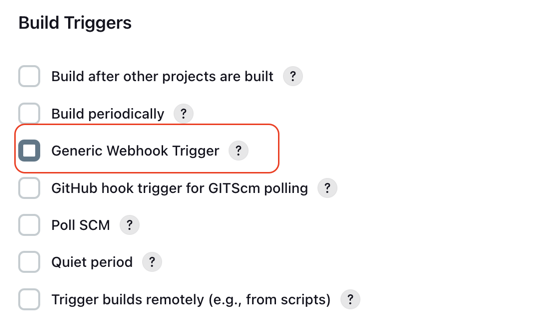

import Image from "@theme/IdealImage";
import DefineVars from "../../../../static/img/self-service-actions/setup-backend/jenkins-pipeline/define-variables.png";

# Triggering Jenkins using webhooks

Triggering your CI/CD pipelines via your developer portal is mandatory for providing self-service experience.
In this guide, you will learn how to trigger your Jenkins Pipelines from Port, using [Webhook Actions](../webhook/).

## Prerequisites

Jenkins required plugins:

- [Generic webhook trigger](https://plugins.jenkins.io/generic-webhook-trigger/) - Allows triggering Jenkins pipelines using webhook calls.

## Setting up the webhook

### Enabling webhook trigger for a pipeline

To enable triggering a Jenkins pipeline using a webhook invocation, you will need to add "Generic Webhook Trigger" as a Build trigger to your pipeline.

In your Job's page, enter the **Configuration** tab, and scroll down to the **Build Triggers** section. Check the `Generic Webhook Trigger` box:



### Defining variables

After checking the box, look for the **Post content parameters** section. This is where you will define the variables which will be passed to your build run.

- The `Variable` field value should match the name of the variable that is defined in your Job configuration and expected by the job run.
- The `Expression` field should be set to `JSONPath` and be directed to the relevant property sent by the Port action.

:::note
Here is a part of the JSON scheme of the Port action, which shows the inputs sent by Port when triggering the action:

```json showLineNumber
{
    ... # Event metadata
    "payload": {
        "properties": {
            "input1": "input1_value",
            "input2": "input2_value"
        }

    }

}
```

For example, the JSONPath for `input1` would be:

```text
$.payload.properties.input1
```

:::

<br/>

<Image img={DefineVars} style={{ width: 550 }} />

<br/>

### Token setup

The [token parameter](https://plugins.jenkins.io/generic-webhook-trigger/#plugin-content-token-parameter) allows triggering a specific (or a group) of jobs.

By default, when enabling the Webhook trigger for a job, it can be triggered by sending an event to `http://JENKINS_URL/jenkins/generic-webhook-trigger/invoke`. This means that, if not configured otherwise, all jobs will be triggered when sending an event to this route. It is recommended to set up a job token to avoid running unwanted jobs.

To set up a token for you job, scroll down to the **Token** section, and provide a job token:


After saving, you will be able to specifically trigger this job job, using the following URL:

```text showLineNumbers
http://JENKINS_URL/jenkins/generic-webhook-trigger/invoke?token=<JOB_TOKEN>
```

:::tip
For advanced configuration of your Jenkins webhook trigger, check out the [Generic webhook trigger](https://plugins.jenkins.io/generic-webhook-trigger/) plugin page!
:::

And now you are ready to trigger your pipeline using Port! All that is left is to create a Port [Webhook Action](../webhook/)!
Here is an example for an action which will trigger the webhook we just set up:

```json showLineNumbers
[
  {
    "identifier": "runPipeline",
    "title": "Run Pipeline",
    "icon": "Jenkins",
    "userInputs": {
      "properties": {
        "input1": {
          "type": "string"
        }
      }
    },
    "invocationMethod": {
      "type": "WEBHOOK",
      "url": "http://JENKINS_URL/jenkins/generic-webhook-trigger/invoke?token=<JOB_TOKEN>"
    },
    "trigger": "CREATE",
    "description": "Run Jenkins pipeline"
  }
]
```

### Securing your webhook

For setting up security for you webhook triggered pipeline, [enable whitelisting](https://plugins.jenkins.io/generic-webhook-trigger/#plugin-content-whitelist-hosts) for your Jenkins plugin, and configure the whitelisting using [this guide](../webhook/signature-verification.md).
