# Quickstart

## What is Port?

**Port** is a Developer Platform meant to make life easier for Developers and DevOps in an organization, by creating a single Platform that acts as a Source-Of-Truth for all of the infrastructure assets and operations that happen in the organization's tech stack.

Port then allows engineers to perform actions on these assets in a self-service fashion. From provisioning a Dev Environment, Understanding who is the owner of a Microservice, or any unique use case DevOps want to self-serve and automate.

### Port helps you to:

* Create a **comprehensive catalog** by mapping all your software and infrastructure components (microservices, monoliths, deployments, repos, databases, and more) and see all of them in one place
* Make your **catalog active** by assigning to it actions that can be used by you and your internal customers, while ensuring unified standards and governance over the processes inside your organization

Port's 3 core building blocks are *Blueprints*, *Entities* and *Relations*. This tutorial will walk you through your first steps on the platform and get you started on your DevPortal journey!🚢 

## Define a blueprint

We use Blueprints to model our data in Port. A Blueprint allows us to define what properties and fields an *Entity* will have.

In Port, you control how the data looks, any data format you can think of can be represented.

We know that every organization is a snowflake, and everybody have their own preferences and standards for representing their data and asset structure, we choose the **Blueprints** approach to enable that.

but for now, let's start with a simple example:

You are a large car manufacturer 🛠, and you want to manage your different car models in Port, so you can easily track all of your car models and variants, different engines and more.

:::note
**Port** is a DevOps tools first, and our goal is to make it easy to manage all of the software components in your organization.

But we feel like it would be easier to understand the **power** Port provides by first going through a simple example that is not specific to the Developer Platform domain.
:::

Let's head to [Port](https://app.getport.io/blueprints) and look at the Blueprints page, at the top right corner let's click on **New Blueprint** and configure our first blueprint - **Car Model** as shown in the image below:


After clicking the button, you should see a creation form similar to what is shown in the image below:


Our Car Model Blueprint is going to include the following properties:

- **Year** - The year the car model was produced

:::note
Don't worry if you feel like the Car Model blueprint should include more properties, you can always go back and add or remove properties later. 
:::

In order to create a Blueprint with the following properties, we will use the following JSON body:

```json
{
    "identifier": "car_model",
    "title": "Car Model",
    "dataSource": "Port",
    "schema": {
        "properties": {
            "year": {
                "type": "number",
                "title": "Year",
                "description": "The year the car model was produced"
            }
        },
        "required": []
    }
}
```

Click on the `save` button, and you should see your new Blueprint in the Blueprints graph:


If you click on the `expand` button as shown in the image below:


You should see an expanded view of the blueprint we just created, with all of the properties listed alongside the types we provided for them:

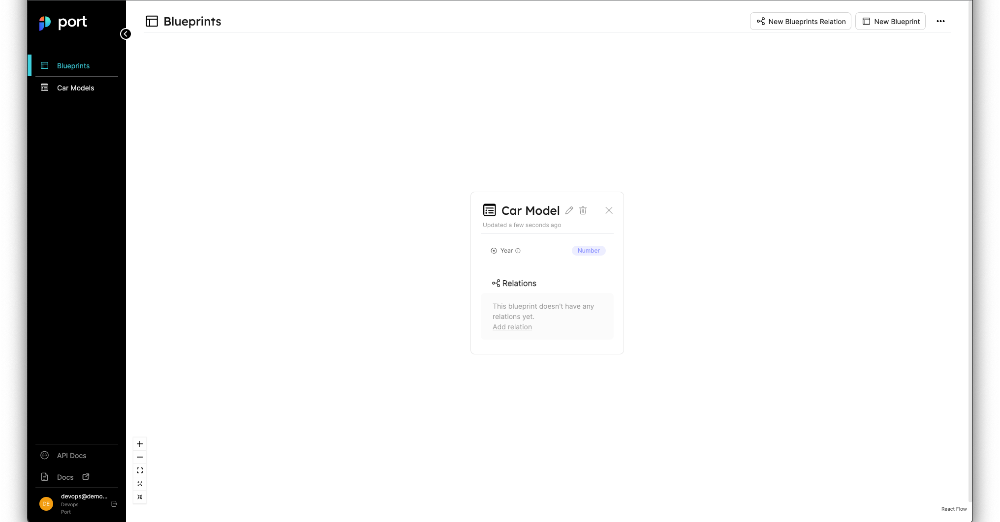

Congratulations! you have just created your first Blueprint! 🎉

In the next part, we will start creating `Entities` that match this new Blueprint, and we will see our car company coming together!

## Create your first entities

Now that we have a Blueprint for **Car Model**, we can add some *Entities*.

An **Entity** is an actual object that is of the type of a certain Blueprint. In our instance, every entity we create under the Car Model blueprint, is a Car Model in our factory.

Let's create our first Entity to make things clearer, In the sidebar on the left side of the page, you can already see the **Car Models** page, so let's click on it:


You should arrive at the Car Models page, now let's create a new Car Model **Entity** by clicking the `+ Car Model` button:

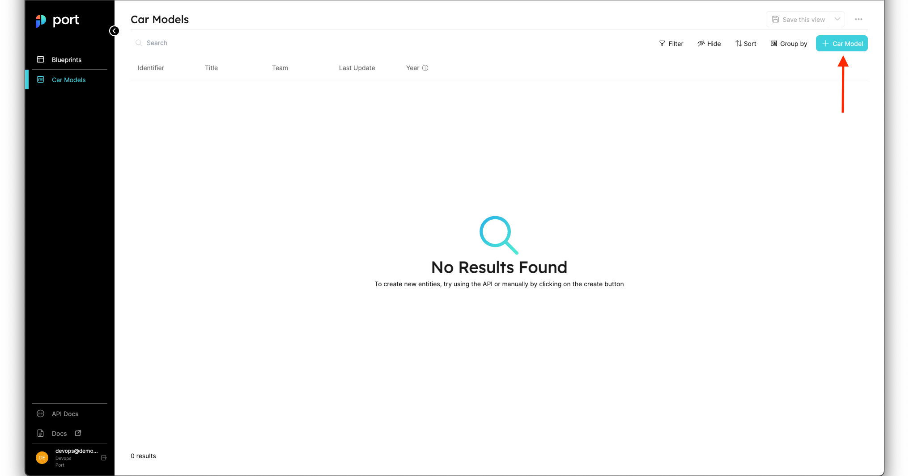

After clicking the button we should see a form to add a new Car Model, let's fill it up with the following details:

```
Title: Aventador
Team: - leave blank -
# For identifier, click on the "Auto generate" toggle to enter a custom identifier
Identifier: aventador
Year: 2022
```

After filling all of these details, your creation page should look like this:

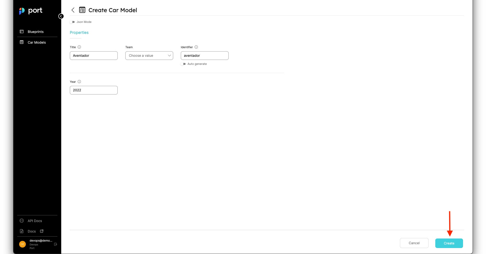

You can go ahead and press the `Create` button at the bottom right corner (as shown in the image above), and you should see your new Car Model in the Car Models page:


Let's repeat the process again, click on the `+ Car Model` again, but this time let's add an entity using JSON by clicking the `Json Mode` button:

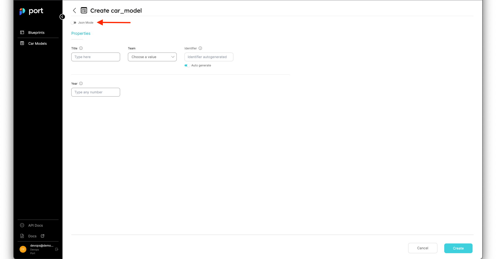

After clicking the button, you will have a JSON editor similar to the one we saw in the blueprints page, paste in the following content:

```json
{
    "identifier": "huracan",
    "title": "Huracan",
    "team": "",
    "blueprint": "car_model",
    "properties": {
        "year": "2022"
    },
    "relations": {}
}
```

Then click on the create button at the bottom right corner:

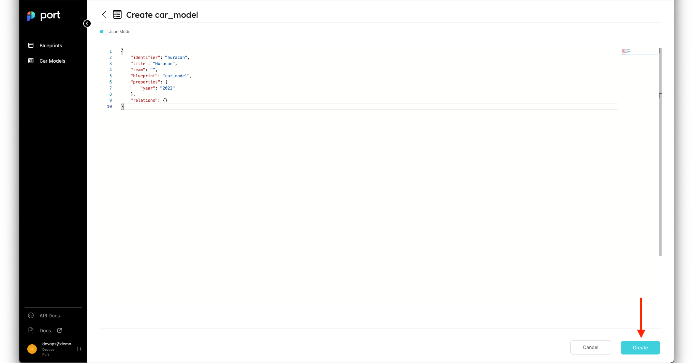

Now you should see your 2 car models displayed in the page like shown in the image below:


Amazing! You have just created 2 awesome entities 🎉

As you can probably realize, we use Blueprints to define our data models, and Entities to store actual objects with data.

In the next part, we will look at our last building block - **Relations** so let's get to it.

## Create a relation

A **Relation** allows us to create a connection between two Blueprints and the entities that are based on them. Using Relations we are able to create a dependency graph between multiple entities, allowing us to query our data more easily, and also view all related entities from a single simplified page.

Currently our car factory only has car models, but everybody knows a car needs an engine, our Engine Blueprint will have the following fields:

- **Horsepower** - How much Horsepower does this engine unit have
- **Volume** - The volume (in liters) of the engine
- **Layout** - The engine layout (I3, V4, Hybrid, Electric, etc...)

In addition, this time we will mark the `horsepower` field as `required`, so we can make sure that our engine has a horsepower value.

Let's go over the steps needed to create our Engine Blueprint:

 so let's go ahead and create an **Engine Blueprint**:

- Go back to the Blueprints page
- Click on the New Blueprint button
- Paste in the content shown below and then click create:

```json
{
    "identifier": "engine",
    "title": "Engine",
    "icon": "GPU",
    "dataSource": "Port",
    "schema": {
        "properties": {
            "horsepower": {
                "type": "number",
                "title": "Horsepower",
                "description": "How much Horsepower does this engine unit have"
            },
            "volume": {
                "type": "number",
                "title": "Volume",
                "description": "The volume (in liters) of the engine"
            },
            "layout": {
                "type": "string",
                "title": "Engine Layout",
                "description": "The engine layout (I3, V4, Hybrid, Electric, etc...)"
            }
        },
        "required": ["horsepower"]
    }
}
```

:::tip
**Remember**, if you are having trouble at any point, we performed the exact same steps with the **Engine** Blueprint in the [Define a Blueprint section](#define-a-blueprint), so you can just go back to that part as reference.
:::

Next, we will create 2 engines to go with our car models, in order to do that we'll go to the newly created **Engines** page, and create them using the JSON bodies written below (remember that you can also create the new engines from the UI, JSON is a bit faster when you already know the contents of your new entity):

**Aventador engine**

```json
{
    "identifier": "aventador_v12",
    "title": "Aventador V12",
    "team": "",
    "blueprint": "engine",
    "properties": {
        "horsepower": "769",
        "volume": "6.5",
        "layout": "V12"
    },
    "relations": {}
}
```

**Huracan engine**

```json
{
    "identifier": "huracan_v10",
    "title": "Huracan V10",
    "team": "",
    "blueprint": "engine",
    "properties": {
        "horsepower": "602",
        "volume": "5.2",
        "layout": "V10"
    },
    "relations": {}
}
```

In case you need a reminder on how to create both of these **Engine Entities**, refer to the following steps:

- Go to the Engines page
- Click on the `+ Engine` button
- Paste in (or manually type) the contents of the two engines and then click create

:::tip
If you are still having trouble, refer back to the [Create Your First Entities](#create-your-first-entities) section
:::

After you're finished, your blueprints page and your Engines page should look like this:


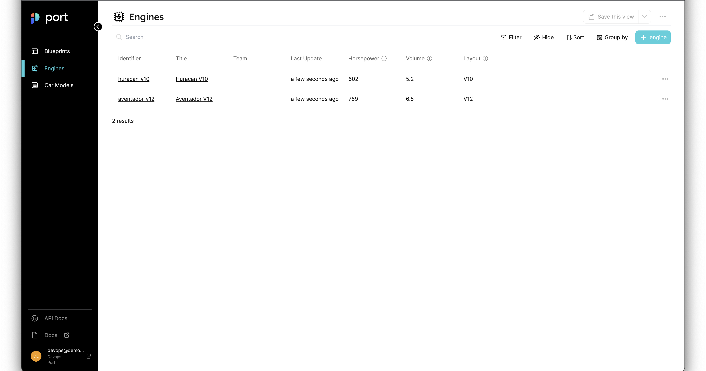

Now that we have 2 Blueprints with Entities to match, we can create a relation between them.

:::info
Remember that our goal is for each **Car Model** to have an **Engine** that goes with it, so that is exactly the relation we are going to create now
:::

### Car Model to Engine relation

Our cars need an engine, so the relation we will map is one where the Engine is **Used In** a Car Model, in order to create that relation, let's follow these steps:

Go to the Blueprints page and click on the `New Blueprints Relation` button like show below:

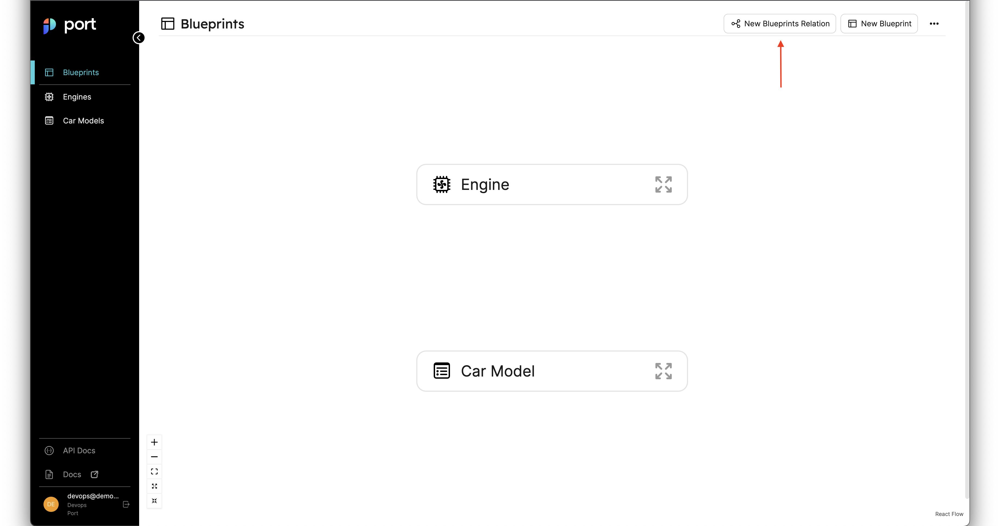

In the creation form that appears, paste in the following content:

```json
{
    "title": "UsedIn",
    "identifier": "car_model-to-engine",
    "source": "engine",
    "target": "car_model",
    "required": true,
    "many": false
}
```

Then click the `save` button at the bottom right corner, as shown in the image below:

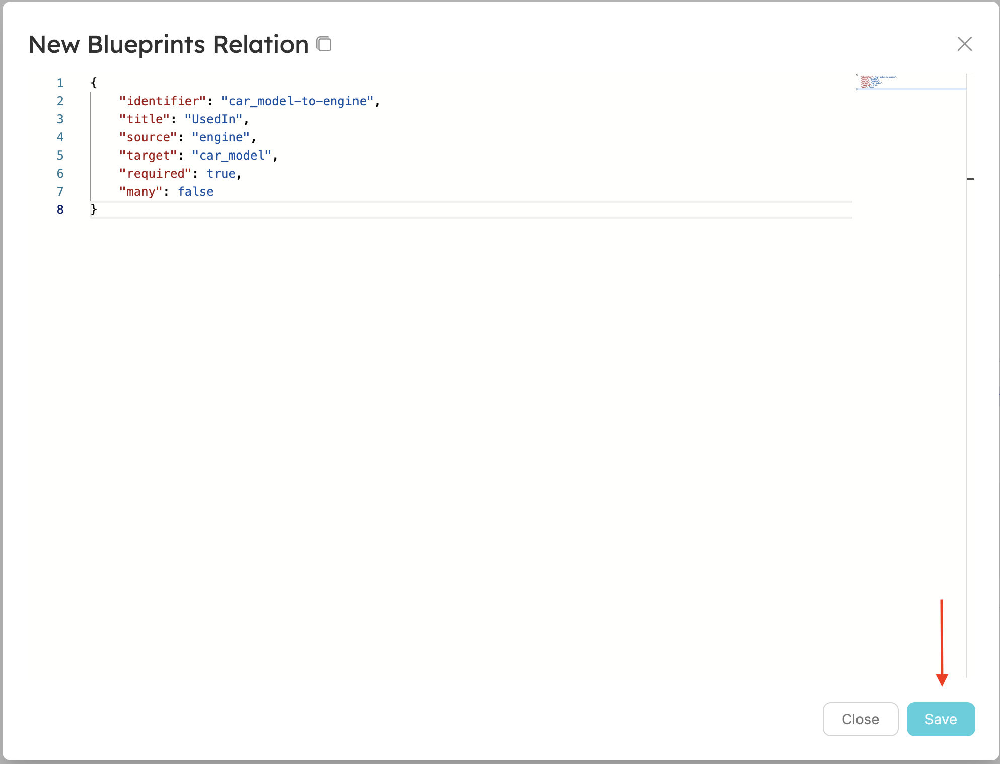

Now your Blueprints graph should look like this:


:::note
Look at the dependency graph we just got, an **Engine Entity is used in a Car Model Entity**, we modeled the relationship between our Blueprints in a way that shows which blueprint depends on the other.
:::

Now that we have a relationship, it's time to use it to show which car uses which engine

### Giving engines a new home (well, car)

To use our new relations, we will go back to the **Engines** page.

We already have an engine for our **Aventador** - that is the `Aventador V12`, and for our **Huracan** - that is the `Huracan V10`.

At the right side of the page you should see 3 dots (`...`) in the line that matches each engine like shown below:

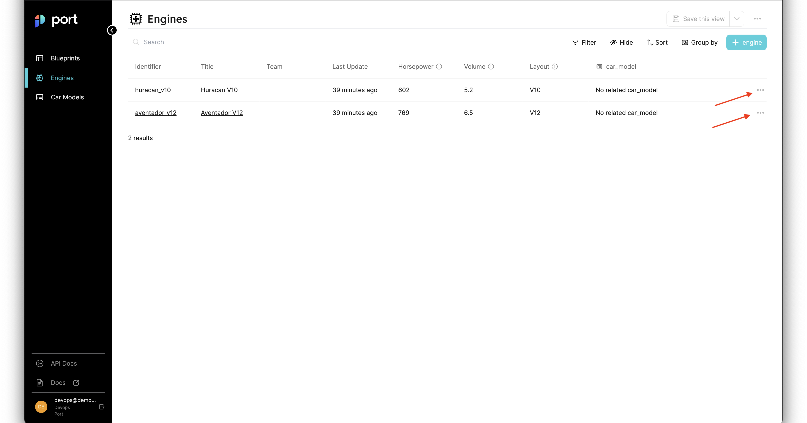

Click on the 3 dots in the line of the `Huracan V10` engine and you should see a menu with an option that says `Show all Properties`, as shown below:


Click on that option and you will once again see the form to edit the details of our `Huracan V10` engine, this time you will see a new section at the bottom of the form that says `Relations` and a drop-down list which after clicking shows you the available car models:

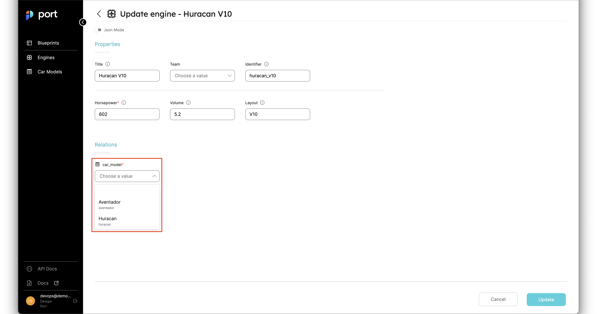

Select the Huracan option from the drop-down list and then click on the `Update` button:

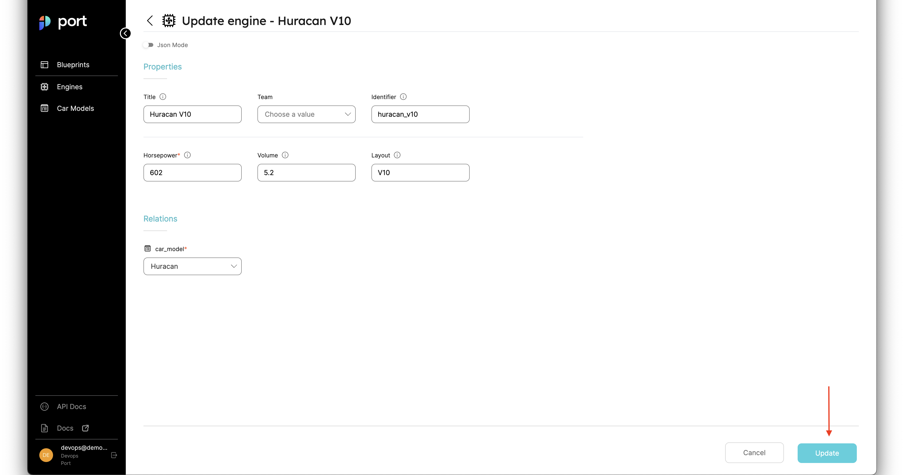

Repeat the same process, only this time select the `Aventador V12` engine from the table, and in the relations drop-down, select the `Aventador` car then click `update`.

After attaching the engines to the car models, your engines page should look like this (notice the marked column and its values):

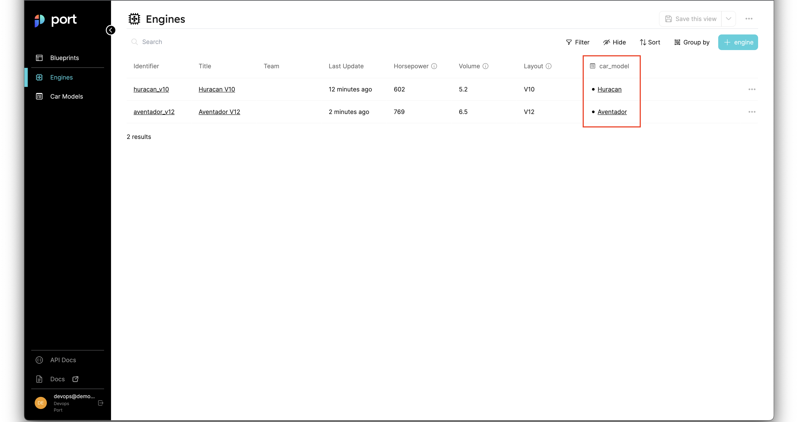

Click on either the `Huracan` or `Aventador` links in the marked column and you will see what we call the **Specific Entity Page**, this page allows you to see the complete details and dependency graph of a specific entity.

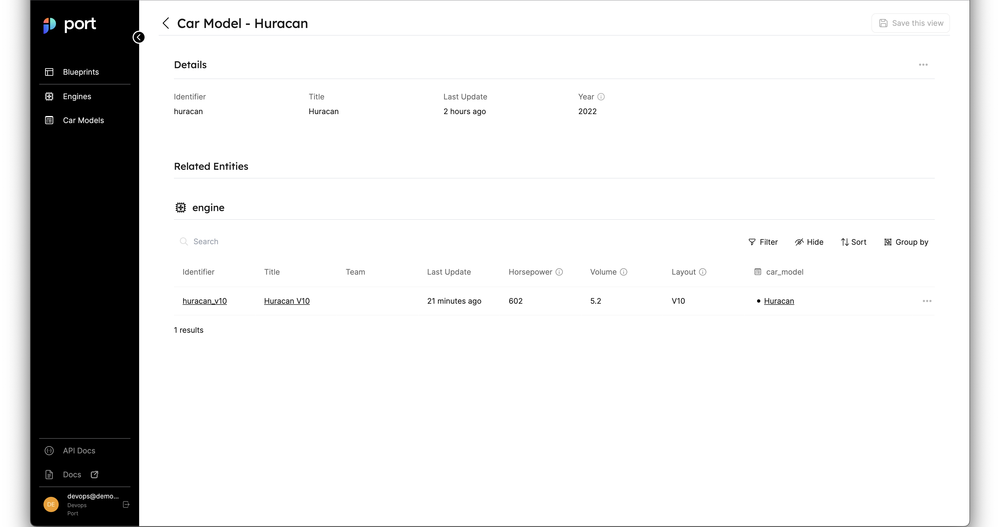

:::info
In our case, the specific entity page for a Car Model, will also show us the Engine that is used in it, because that is the relation we mapped.
:::

feel free to continue exploring the specific entity page and also the Engines and Car Models pages, notice the `Filter`, `Hide`, `Sort` and `Group By` controls you can find at the top right of Port's table widgets.

## What now?

Congratulations! you just modeled your first environment in Port! 🎉🚢

This quickstart was used to show you a basic example that doesn't require any domain-specific knowledge, but now you have all the tools you need to get started!

You can begin creating Blueprints that describe your `Services`, `Applications`, `Clusters`, `Infrastructure resources`, or continue your new Car Manufacturer journey!

### Recommended next steps

:::tip
These suggestions show the basic steps in creating your very own Developer Portal, if you want to learn more about Port before starting your DevPortal journey, look at [Diving deeper](#diving-deeper) or [Using the API](#using-the-api) below.
:::

1. Create [Blueprints](../setup-your-port/setup-catalog/blueprints) for your software and infrastructure components
2. Map out the [Relations](../setup-your-port/setup-catalog/relations) between your Blueprints
3. Ingest data to your catalog by creating [Entities](../setup-your-port/setup-catalog/entities) based on your Blueprints via Port's UI or using our API
4. Define Actions that can be used by you and your developers

### Diving deeper

If you want to learn more about Port's capabilities in a specific area, you can check out any of these resources:

- [Blueprints Deep Dive](../setup-your-port/setup-catalog/blueprints)
- [Relations Deep Dive](../setup-your-port/setup-catalog/relations)
- [Entities Deep Dive](../setup-your-port/setup-catalog/entities)
- [Pages Deep Dive](../setup-your-port/setup-catalog/pages)
- Mirror Properties Deep Dive

### Using the API

If you want to take advantage of Port's REST API Interface, take a look at these resources:

- API At a Glance
- Port API Reference
