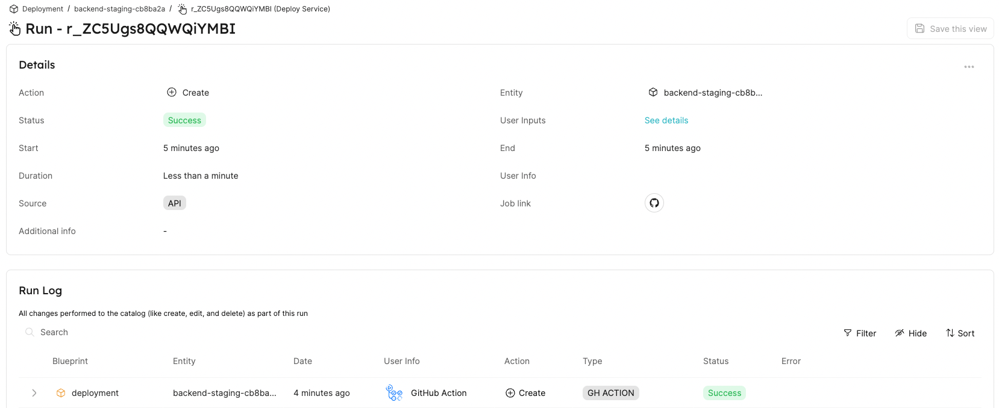

# Run a deployment for a service

In the following guide, you are going to build a self-service action in Port, that executes a GitHub workflow behind the scenes.

The GitHub workflow in this example, is meant to run a new deployment and report back a deployment entity to Port.

## Prerequisites

- A Port API `CLIENT_ID` and `CLIENT_SECRET`.

## Creating the GitHub workflow

First, we need to set up a GitHub workflow that implements our business logic for deployment.

Here is a skeleton for the workflow - `deploy.yml` (including a placeholder for deployment logic):

<details>
<summary>Deployment GitHub workflow</summary>

```yaml showLineNumbers
name: CI
on:
  workflow_dispatch:
    inputs:
      service:
        required: true
        description: "Service name to deploy"
        type: string
      environment:
        required: true
        default: staging
        description: "Environment to deploy service to"
        type: string
      port_payload:
        required: true
        description: "Port's payload, including details for who triggered the action and general context (blueprint, run id, etc...)"
        type: string
jobs:
  deploy:
    runs-on: ubuntu-latest
    steps:
      - uses: actions/checkout@v3
      - id: echo-deploy
        run: echo "deploy"

      # ADD YOUR DEPLOYMENT LOGIC HERE!!!

  report-deployment:
    name: Report new deployment Entity
    runs-on: ubuntu-latest
    steps:
      - name: Extract SHA short
        run: echo "SHA_SHORT=${GITHUB_SHA:0:7}" >> $GITHUB_ENV
      - name: "Report deployment Entity to port 🚢"
        uses: port-labs/port-github-action@v1
        with:
          clientId: ${{ secrets.PORT_CLIENT_ID }}
          clientSecret: ${{ secrets.PORT_CLIENT_SECRET }}
          identifier: ${{ inputs.service }}-${{ inputs.environment }}-${{ env.SHA_SHORT }}
          blueprint: deployment
          properties: |
            {
               "jobUrl": "${{ github.server_url }}/${{ github.repository }}/actions/runs/${{ github.run_id }}",
               "deployingUser": "${{ github.actor }}",
               "imageTag": "latest",
               "commitSha": "${{ env.SHA_SHORT }}"
            }
          runId: "${{fromJson(inputs.port_payload).context.runId}}"
```

</details>

:::note
Pay attention to the additional parameter in the workflow called `port_payload`.
This parameter is filled out automatically by default with the [Port's action message](../../self-service-actions-deep-dive.md#action-message-structure).
You can disable it by specifying `"omitPayload": true` in the Port's action definition.
For more details click [here](../../self-service-actions-deep-dive.md#invocation-method-structure-fields)
:::

## Creating the Deployment blueprint

Let’s configure a `Deployment` Blueprint. Its base structure is:

<details>
<summary>Deployment Blueprint JSON</summary>

```json showLineNumbers
{
  "identifier": "deployment",
  "title": "Deployment",
  "icon": "Deployment",
  "schema": {
    "properties": {
      "jobUrl": {
        "type": "string",
        "format": "url",
        "title": "Job URL"
      },
      "deployingUser": {
        "type": "string",
        "title": "Deploying User"
      },
      "imageTag": {
        "type": "string",
        "title": "Image Tag"
      },
      "commitSha": {
        "type": "string",
        "title": "Commit SHA"
      }
    },
    "required": []
  },
  "mirrorProperties": {},
  "calculationProperties": {},
  "relations": {}
}
```

</details>

:::tip
Remember that Blueprints can be created both from the [UI](../../../software-catalog/blueprint/tutorial.md#from-the-ui) and from the [API](../../../software-catalog/blueprint/tutorial.md#from-the-api)
:::

## Creating the Port action

Now let’s configure a Self-Service Action. You will add a `CREATE` action that will be triggered every time a developer wants to initiate a new deployment for a service.

Here is the action JSON:

:::note
Remember to replace the placeholders for `<GITHUB_ORG>`, `<GITHUB_REPO>`.
:::

```json showLineNumbers
{
  "identifier": "deploy_service",
  "title": "Deploy Service",
  "icon": "DeployedAt",
  "userInputs": {
    "properties": {
      "ref": {
        "type": "string",
        "description": "The GitHub branch to deploy (Optional, otherwise will use repo's default branch)"
      },
      "service": {
        "type": "string",
        "description": "The service to deploy"
      },
      "environment": {
        "type": "string",
        "description": "The environment to deploy the service to"
      }
    },
    "required": ["service", "environment"]
  },
  "invocationMethod": {
    "type": "GITHUB",
    "org": "<GITHUB_ORG>",
    "repo": "<GITHUB_REPO>",
    "workflow": "deploy.yml"
  },
  "trigger": "CREATE",
  "description": "Deploy a service to the environment"
}
```

Now that the Self-Service Action configured, you can begin invoking it.

## Triggering the action

Let's invoke the Self-Service action using Port API.

<details>
<summary>Click here to see the API call code</summary>

```python showLineNumbers
import requests

CLIENT_ID = 'YOUR_CLIENT_ID'
CLIENT_SECRET = 'YOUR_CLIENT_SECRET'

API_URL = 'https://api.getport.io/v1'

credentials = {'clientId': CLIENT_ID, 'clientSecret': CLIENT_SECRET}

token_response = requests.post(f'{API_URL}/auth/access_token', json=credentials)

access_token = token_response.json()['accessToken']

headers = {
    'Authorization': f'Bearer {access_token}'
}

blueprint_identifier = 'deployment'

action_identifier = 'deploy_service'

action_run = {
    'properties': {
        'service': 'backend',
        'environment': 'staging'
    }
}

response = requests.post(f'{API_URL}/blueprints/{blueprint_identifier}/actions/{action_identifier}/runs', json=action_run, headers=headers)

print(response.json())
```

</details>

When the action is finished, it will mark the action run as successful. That way, your developers can tell that the deployment has finished successfully.



## Next steps

This was a very basic example on how to trigger a GitHub workflow using Port's self-service action. We left placeholder code for you to insert your own custom logic that fits your infrastructure.
