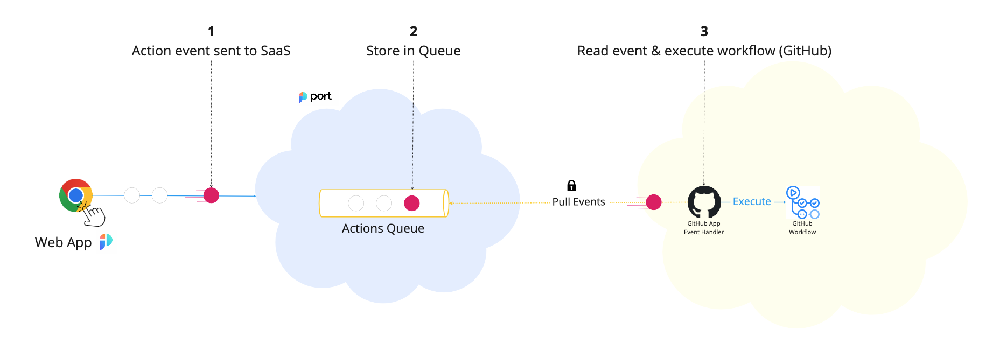

# GitHub Workflow Self-Service Actions

[Port's GitHub application](../../exporters/github-exporter/installation.md) can trigger a [GitHub workflow](https://docs.github.com/en/actions/using-workflows) using a customer provided input and [`port_payload`](../../self-service-actions/self-service-actions-deep-dive.md#action-message-structure).

The steps shown in the image above are as follows:

1. Port publishes an invoked `Action` message to a topic;
2. A secure topic (`ORG_ID.github.runs`) holds all the action invocations;
3. A listener implemented on Port's GitHub application receives the new topic message and runs GitHub workflow defined by the DevOps team.

An example flow would be:

1. A developer asks to deploy a new version of an existing `Microservice`;
2. The `create` action is sent to the `github.runs` topic;
3. Port's GitHub application event handler is triggered by this new action message;
4. Port's GitHub application triggers the GitHub workflow that deploys a new version of the service;
5. As part of the workflow, the new Microservice `Deployment` is reported back to Port;
6. When the workflow is done, Port's GitHub application reports back to Port about the status of the action run (`SUCCESS` or `FAILURE`), according to workflow's `conclusion`.

## Next steps

To get started with GitHub Self-Service Actions, please check the sources below:

- [Run a deployment for a service](./examples/run-service-deployment.md)
