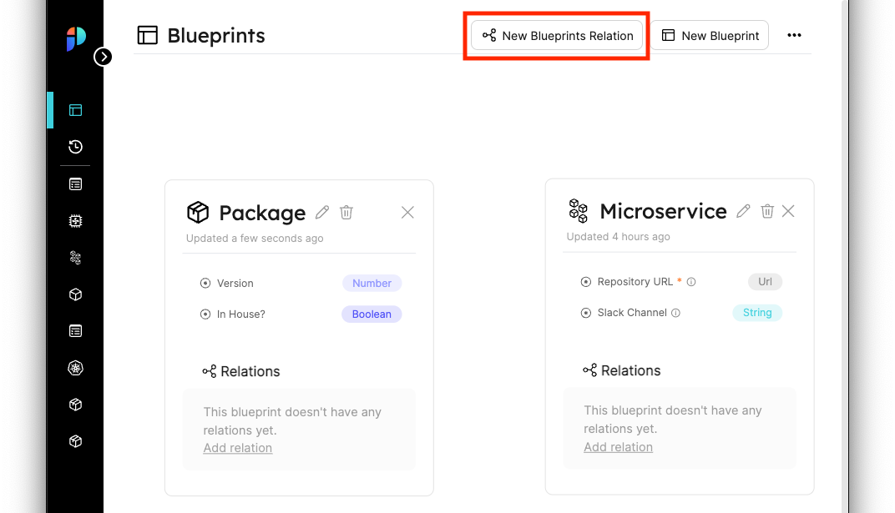

# Entities

An entity is the data inside Port that represents your software and infrastructure. Entities are created based on Blueprints.

## understanding the structure of an entity

The basic structure of an Entity request:

```json
{
    "identifier": "UniqueID",
    "title": "Title",
    "blueprint": "blueprintName",
    "properties": {
        "property1": "",
        "property2": ""
    },
    "relations": {}
}
```

- `identifier` - A unique identifier (Note that while the identifier is unique, it can be changed after creation)
  - Port's API can automatically generate a unique identifier for entities, we will see how in the [Creating entities](#creating-entities) section
- `title` - A nicely written name for the entity
- `blueprint` - The name of the [Blueprint](blueprints) this entity is based on.
- `properties` - An object containing key-value pairs where each key is a property in the blueprint the entity is based on
- `relations` - An object containing key-value pairs where each key is the name of a [Relation](relations) defined over the blueprint this entity is based on.

:::info teams and ownership
Entities also have the `team` key which defines ownership over an entity and also controls who can modify or delete an existing entity.

For now we are not going to assign a team to our entities, but we will explore this topic in more depth in the Teams, Users and Permissions section.
:::

## Creating entities

:::note
Remember that an access token is needed to make API requests, refer back to [Getting an API token](blueprints#getting-an-api-token) if you need to generate a new one
:::

:::info
We will be creating entities for the `Microservice` blueprint from [Creating a Blueprint](blueprints#creating-a-blueprint) and the `Package` blueprint from [Blueprint Next Steps](blueprints#next-steps), please make sure create them before reading on if you want to follow along
:::

We'll present 2 ways to create entities:

- From the UI
- From the API

### From the UI

In order to create an entity from the UI, go to the [Page](pages) matching the Blueprint you want to add an entity to, you can find the page list in the sidebar on the left side of Port's UI

We will first go to the `Microservices` page:



After clicking the button an editor window will open with a format similar to the one we explained in the [Understanding the structure of a relation](#understanding-the-structure-of-a-relation) section, paste in the following content to create the `Package-Deployment` relation:

```json
{
    "identifier": "package-microservice",
    "title": "Used In",
    "source": "package",
    "target": "microservice",
    "required": false
}
```