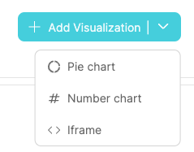

# Dashboards

Port supports multiple visualizations, allowing you to display data from your software catalog in a visual and graphic manner, making it easier to create custom dashboard and make sense of large datasets.

Continue reading to learn more about our visualization types:

## Creating visualizations

- On the top right of the page click on `Add Visualization` button;
- Select the desired visualization:



- Fill out the form and click save.


## Editing visualizations

- On the top right of the pie chart widget click on the three dots icon;
- Select your desired action (edit/delete).


## Visualization types

### Pie chart

You can create a pie chart illustrating data from Entities in your software catalog divided by categories and Entity properties inside a Specific Entity Page [**Specific Entity Page**](../entity/entity.md#entity-page).

#### Visualization properties

| Field                   | Type     | Description                                                                                                                      | Default | Required |
| ----------------------- | -------- | -------------------------------------------------------------------------------------------------------------------------------- | ------- | -------- |
| `Title`                 | `String` | The title of the visualization                                                                                                   | `null`  | `true`   |
| `Icon`                  | `String` | The icon of the visualization                                                                                                    | `null`  | `false`  |
| `Description`           | `String` | A short description to describe the visualization                                                                                | `null`  | `false`  |
| `Blueprint`             | `String` | The Blueprint to visualize the data of its Related Entities                                                                      | `null`  | `true`   |
| `Breakdown by property` | `String` | Group your chart by a specific property                                                                                          | `null`  | `true`   |
| `Filters`               | `Array`  | Filters to include or exclue specific data based on Port's [Search Rules](../../software-catalog/search-in-port.md#search-rules) | []      | `false`  |

#### Example: Filter only `Deployment` entities from last week

Assuming we have a [Blueprint](../../software-catalog/blueprint/blueprint.md) that is called `Service` which is related to another called `Deployment` and we want to create visualizations on top of last week's deployments of this service.

To achieve this desired state, we can go into one of the `Service`'s specific page and create a new visualization and after selecting the `Deployment` Blueprint in the dropdown we can fill the use the `Filters` array by the following JSON:

```json showLineNumbers
[
  {
    "property": "$createdAt",
    "operator": "between",
    "value": {
      "preset": "lastWeek"
    }
  }
]
```
