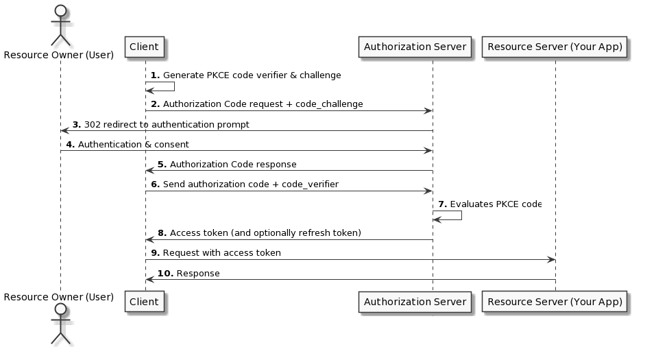

# Authentication

With this feature, you can now embed another website that's protected by SSO authentication.
To do this, you'll need the required parameters to create a JWT token.

## Authentication Code flow + PKCE

preceding: The widget will generate a PKCE. (`code_challnage` & `code_verifier`)

1. The widget URL is set to the `authorizationUrl` along with the `clientId` and the generated `code_challange`.
2. The widget will then be redirected to the SSO sign-in page.
3. The user will sign in using the SSO. (If the user is already signed in to the SSO, this step will happen automatically)
4. The SSO sign-in page will redirect the widget back to https://app.getport.io with the authorization code as a URL hash parameter.
5. The widget will send the `code`, `clientId` and the `code_verifier` to the `tokenURL`, and retrieve the access token from the response.
6. The widget will pass the access token as a query parameter `auth_token={accessToken}` to the URL specified in the property value.



## Required Parameters

To set up the authentication, you'll need the following parameters:

- `clientId`
- `authorizationUrl`
- `tokenUrl`

Here's an example of how to apply these parameters in your Blueprint:

```json showLineNumbers
{
  "title": "Grafana",
  "type": "string",
  "format": "url",
  // highlight-start
  "spec": "embedded-url",
  "specAuthentication": {
    "clientId": "your-client-id",
    "authorizationUrl": "your-authorization-url",
    "tokenUrl": "your-token-url"
  }
  // highlight-end
}
```

## Examples

#### Okta

<details>
    <summary>Setup</summary>

**Steps:**

1. Follow steps in [right here on Okta documentation](https://developer.okta.com/docs/guides/implement-grant-type/authcodepkce/main/) to create an Application in your Okta Organization.
2. Add Port Host to Trusted Origins:
   1. Go to Security > API > Trusted Origins.
   2. Add https://app.getport.io as a new origin. Check Cross-Origin & Redirect checkboxes.
3. Enable IFrame for Sign-In Page:
   1. Go to Customizations > Other
   2. Scroll to "IFrame Embedding" and enable it.

<br />

**How to configure my Grafana with OAuth & Port embedding?**
:::info Note
The following example is just for illustration purposes and may not reflect the actual URLs and client IDs used in
your Okta setup.

Based on Grafana docs for [JWT Configuration](https://grafana.com/docs/grafana/latest/setup-grafana/configure-security/configure-authentication/jwt/) & [OAuth Configuration](https://grafana.com/docs/grafana/latest/setup-grafana/configure-security/configure-authentication/generic-oauth/)

:::

```ini
[security] -> Required for the embedding
allow_embedding = true

[auth.jwt] -> Required for the embedding
...
jwk_set_url = https://{your-okta-org}.okta.com/oauth2/default/v1/keys
expected_claims = {"iss": "https://{your-okta-org}.okta.com", "aud": "https://{your-okta-org}.okta.com"}
url_login = true
...

[auth.generic_oauth] -> Regular OAuth authentication
...
client_id = {CLIENT_ID}
client_secret = {CLIENT_SECRET}
auth_url = https://{YOUR_OKTA_ORG}.okta.com/oauth2/v1/authorize
token_url = https://{YOUR_OKTA_ORG}.okta.com/oauth2/v1/token
api_url = https://{YOUR_OKTA_ORG}.okta.com/oauth2/v1/userinfo
enable_login_token = true
use_pkce = true
...
```

</details>

# Todo: do i need to talk about the iframe restrictions with cookies?

# Todo: Add a gif maybe

# Trouble shooting

# Read more?
