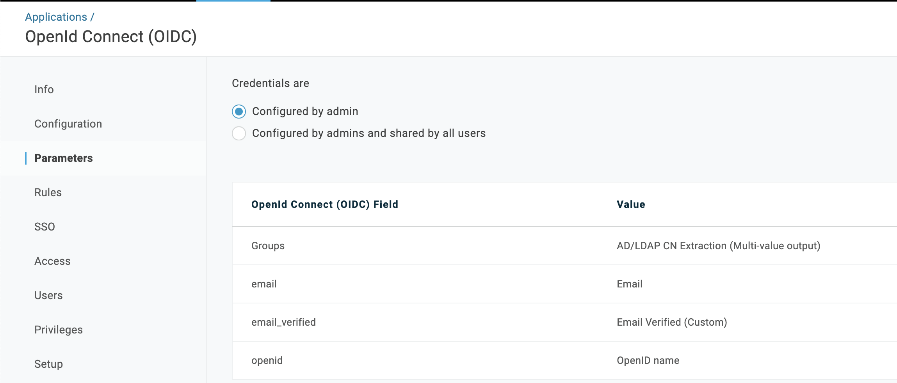
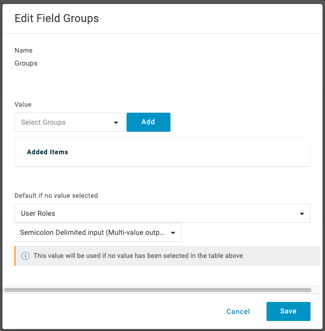

# How to configure JumpCloud

This is a step-by-step guide to configuring the integration between Port and JumpCloud.

:::info
In order to complete the process you will need to contact Port to deliver and receive information, as detailed in the guide below.
:::

## Port-JumpCloud Integration Benefits ​

- Connect to the Port application via a JumpCloud app;
- Your JumpCloud teams will be automatically synced with Port, upon user sign-in;
- Set granular permissions on Port according to your JumpCloud user groups.

## How to configure the JumpCloud app integration for Port​

### Step #1: Create a new JumpCloud application

1. In the Admin Portal, go to User Authentication -> SSO.
2. Click `Add New Application`.


3. In the search box type **Auth0**, then select `OpenId Connect (OIDC)`:


4. Define the initial Port application settings:

   1. `Display Label`: Insert a name of your choice for the Port app, like `Port`.
   2. Add an icon (optional):

    3. In the SSO tab, change the default IDP URL suffix (optional, default is `auth0`).
   

Click `activate`.

5. Click on the newly created application.
   1. Download the IDP Certificate:
      
   2. Copy the `IDP URL` from the SSO tab
6. Via intercom/slack, provide Port with the downloaded `certificate.pem` file, and the IDP URL.

Port will then provide you with your `{CONNECTION_NAME}`. Replace the following occurrences with the provided value.

:::tip
Most of the following steps involve editing the initial Port app you created. Keep in mind you can always go back to it by opening the admin console and going to User Authentication -> SSO, the Port app will appear in the application list.
:::

### Step #2: Configure your JumpCloud application

In the Port app, go to the `SSO` menu and follow these steps:

1. Under `IdP Entity ID:` paste the following URL:

```text showLineNumbers
https://auth.getport.io
```

2. Under `SP Entity ID:` set: `urn:auth0:port-prod:{CONNECTION_NAME}`.

3. Under `ACS URLs`, set: `https://auth.getport.io/login/callback?connection={CONNECTION_NAME}`


Click `Save`.

:::caution
Be sure to click save before moving on to the next step because without the `Redirect URI's` filled in, trying to save any other application parameter will result in an error.
:::

### Step #3: Set `email_verified` custom attribute to the Port App

The use of Auth0 requires that JumpCloud passes to Port an `email_verified` field upon user login. JumpCloud does not store and expose that field by default, so in this step, you are going to configure that field and apply it to all users in your JumpCloud account.

1. In the Port app, go to the `SSO` tab, under the **Constant Attributes** section:
2. Click on `add attribute`.
3. Enter the following details:
   1. `Service Provider Attribute Name`: email_verified
   2. `Value`: true


The custom field is `null` by default, in order to change its value to `true` you will create a custom mapping rule:

:::note
It is also possible to manually change the value of the `email_verified` field to `true` for each user that requires access to Port in your organization. However, granting access manually to a large number of users is not scalable.
:::

### Step #4: Exposing the application to your organization

1. In the `Application` page, select the Port app and go to the `Access` menu.
2. In the `Roles` section, select the roles you want to expose the Port app to:

   

3. Click `Save`.

After completing these steps, users with roles that the Port app was assigned to, will see the Port app in their Portal and upon clicking it, will be logged in to Port:

[Onelogin Portal With Port App](../../../static/img/sso/onelogin/OneloginPortalWithApp.png)

---

## How to allow pulling Onelogin roles to Port

:::note
This stage is **OPTIONAL** and is required only if you wish to pull all of your Onelogin roles into Port inherently.

**Benefit:** managing permissions and user access on Port.  
**Outcome:** for every user that logs in, we will automatically get their associated Onelogin roles, according to your definition in the settings below.
:::

To allow automatic Onelogin roles support in Port, please follow these steps:

1. In the `Application` page, select the Port app and go to the `Parameters` menu;

2. Click on the `Groups` claim:

   

3. Update the groups claim:

   1. Change the value of `Default if no value selected` to `User Roles`;
   2. From the dropdown, select `Semicolon delimited input`:

   

   3. Click `Save`.

4. Click `Save`.
